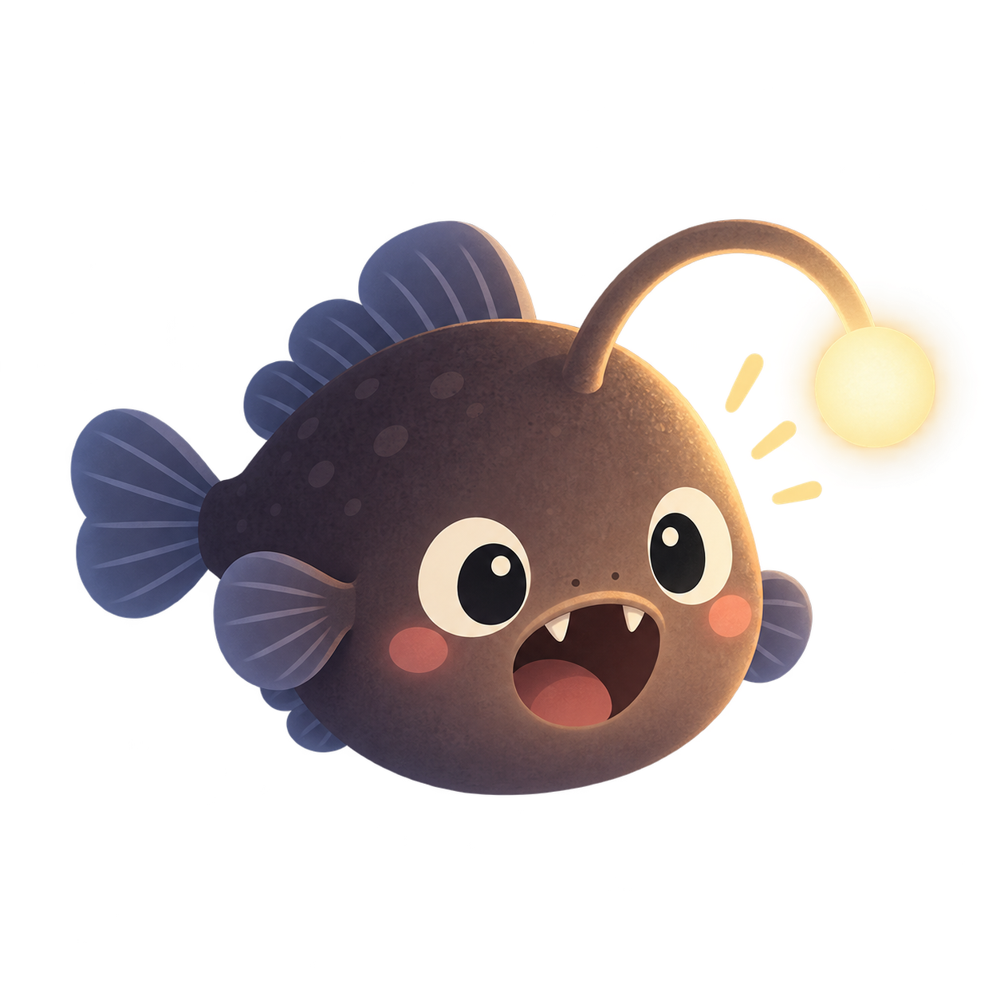

# Subsea Cable Brand and Mascot

This page is the canonical public-brand reference for Subsea Cable. Branding
does not define language semantics, and the downloadable files below are kept
in this repository so people and agents can use the same source assets.

## Brand Contract

| Role | Canonical form |
|---|---|
| Official language name | **Subsea Cable** |
| Visual short mark | **`__C`** |
| Source extension | **`.vyg`** |
| Portable slug/language ID | **`subsea-cable`** |
| Markdown code-fence alias | **`subsea`** |

Use **Subsea Cable** in prose, speech, package descriptions, search metadata,
and the first textual occurrence on a page. `__C` may stand beside it as a
wordmark:

```text
__C — Subsea Cable
```

Use `.vyg` only for Subsea Cable source files, for example `deploy.vyg`.
External implementations may choose their own executable and package names; the
language does not reserve `subc` as a CLI.

## The Footballfish

<figure class="brand-scene" markdown>


<figcaption>The Subsea Cable footballfish encounters the Cable in the deep Sea.</figcaption>

</figure>

The **footballfish** is the Subsea Cable mascot. It belongs at the point where
the language's metaphor becomes tangible: deep in Goal Space, beside the Cable,
carrying just enough light to disclose what is demanded next.

That association is illustrative, not semantic. The mascot is not the Vessel,
Host, Scheduler, or a special kind of Goal. It gives the project a recognizable
face without adding another concept to the language model.

## Download the Mascot

<div class="brand-assets" markdown>
<div class="brand-asset" markdown>



### Transparent mascot

PNG · 1254 × 1254 · transparent background

[Download transparent PNG](assets/branding/subsea-cable-footballfish-mascot-transparent.png){ .md-button .md-button--primary download }

</div>
<div class="brand-asset" markdown>


### Undersea scene

PNG · 1254 × 1254 · full background

[Download scene PNG](assets/branding/subsea-cable-footballfish-scene.png){ .md-button download }

</div>
</div>

The files above are the original-resolution repository assets. Link to this page
when possible so people can obtain an unmodified source rather than a compressed
copy.

## Usage Guardrails

- Do not rename the language “SubC.” That spelling is not the short name.
- Do not use `__C` as a source identifier, namespace, package, API symbol,
  generated symbol, CLI command, URL slug, or machine-readable language ID.
- Do not make semantic meaning depend on the visual mark or mascot.
- In plain-text contexts that can lose underscores, write **Subsea Cable**.
- Image alt text and accessibility labels use **Subsea Cable**, not only `__C`.
- When presenting an asset as official, preserve its proportions and avoid
  changes that could be mistaken for a new official variant.

The two underscores evoke *sub* and *subsea*. `C` carries *sea* and *cable*;
the mark can also be read as “C for agents.” These are brand associations, not
grammar or runtime contracts.

## Asset License

The mascot files are distributed with this repository under the
[Apache License 2.0](LICENSE). Redistribution must preserve the notices required
by that license. The naming rules on this page identify the project consistently;
they do not add language semantics or change the license terms.
