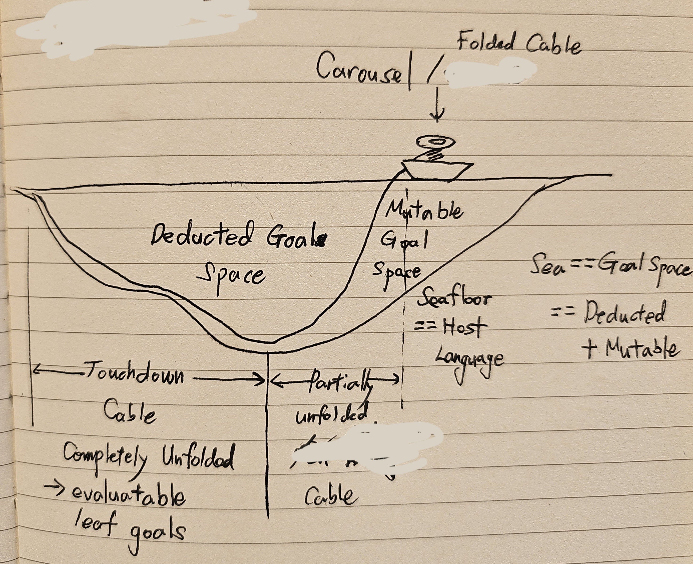

# The Subsea Cable World

> **A program is not a sequence of function calls. A program is a Subsea
> Cable.**



This sketch is the conceptual anchor for the language. The image is
explanatory; the text below gives agents and implementations its precise
meaning.

Every metaphor corresponds to an actual responsibility or state transition.

## The complete picture

```text
Surface: intent and the one Root
                    Vessel / Consumer Runtime
               [ Carousel + Store + Scheduler ]
                          |
                      Folded Cable
~~~~~~~~~~~~~~~~~~~~~~~~~~|~~~~~~~~~~~~~~~~~~~~~~~~~~~~~~~~~~~~
                          |        Sea = Goal Space
                          |        undeduced occurrence = mutable
                          v
 committed deductions ────●──── deduction frontier
 =========================|====================================
 Seafloor: Host-provided concrete computation
        Touchdown Cable = paths deduced all the way to leaves
```

The real frontier is not one global point. A Goal DAG can have many branches,
so the frontier is the set of Goal occurrences that have been exposed but not
yet deduced.

## Surface

The Surface is the intent visible to the author:

```text
Build User
Send Email
Publish Report
```

There is one Root. It selects where deduction begins; it is not an instruction
to execute the entire Program eagerly.

## The Sea: Goal Space

The Sea is the entire Goal Space occupied by the Program. At any moment it
contains both:

```text
Goal Space = committed deductions + still-mutable Goal occurrences
```

The Program exists from the start as a deferred Cable. Its eventual concrete
Goal DAG is not required to be fully materialized or permanently fixed from the
start. It is disclosed incrementally by deduction.

## The Cable: the Program

The Cable is the Program representation itself. It contains Goals,
dependencies, routing, Anchors, and policies. It is not an instruction stream,
bytecode, a virtual machine, or a Scheduler.

The Cable can exist in three related states:

| State | Precise meaning |
|---|---|
| Folded | The Goal occurrence has not been demanded for deduction. |
| Partially unfolded | Some deduction results are committed, while newly exposed descendant occurrences remain undeduced and mutable. |
| Touchdown | Successive deductions have reached a concrete leaf. |

Partially unfolded never means “everything in this region is mutable.” Every
completed deduction is already committed. Only occurrences that have not yet
deduced themselves retain a mutable name-to-hash choice.

## Reduction and Deduction

These terms are deliberately different.

**Reduction** is the language rule describing how one resolved Goal definition
and its arguments produce subordinate structure or a leaf.

**Deduction** is the demand-driven Runtime event that applies that rule to one
Goal occurrence:

```text
undeduced Name/Arity occurrence
        |
        | demand
        v
resolve the current alias to an ArtifactHash
        |
        v
apply the artifact's reduction rule
        |
        v
commit the chosen hash and resulting structure
```

> **Deduction is the commit.**

An occurrence resolves its unqualified `Name/Arity` only when that occurrence
is demanded for deduction. The mapping may change until that instant. After the
deduction commits, later alias changes cannot rewrite it.

Children exposed by the committed deduction are new occurrences. Their
existence and dependency position are committed, but each unqualified child
retains its own lazy name-to-hash choice until it is itself demanded.

This is demand paging for Goal structure:

```text
Name/Arity       virtual address
name index       page table
ArtifactHash     immutable page identity
deduction demand page fault
deduction record committed mapping and expansion
```

A hash-qualified reference is already pinned to an immutable artifact, although
its structural reduction may still remain lazy.

## Mutable Goal Space

Mutable does not mean that an immutable artifact is edited in place. A change
creates a new artifact and moves a human-readable alias:

```text
B/1 -> hash-1

new definition stored as hash-2
B/1 -> hash-2
```

An already deduced occurrence of `B/1` remains bound to `hash-1`. An undeduced
occurrence may later bind to `hash-2`. Two occurrences of the same name can
therefore choose different artifacts when they are demanded at different times.

The deduction ledger makes this mutable future auditable. It records, for every
deduction, at least the occurrence, requested name and arity, selected full
hash, arguments, resulting structure, active lineages, and the observed
codebase revision.

## Vessel

The Vessel is the metaphor for the complete Consumer Runtime. It carries the
Frontend, Codebase and Deduction Ledger, Carousel, Outcome & Value Store,
Scheduler, and Host connection. It is not a separately implementable deduction
component and never competes with Carousel for ownership of a transition.

The Vessel is also what steers. The Seafloor is a given three-dimensional
terrain, and the Program is the route across it: writing the Root and the Goals
beneath it says where this Vessel sails. Carousel then pays out Cable along
that route, and the two-dimensional Touchdown Cable that results is the section
of the Seafloor the chosen route reaches. Nobody authors the Touchdown shape:
the route selects where the Cable lands, the Seafloor decides what is there,
and Carousel records what actually happened.

Because the Vessel is the whole that holds the route, the engine, the store,
and the ports, it is also the thing an outside operator or agent addresses. An
agent asks a Vessel to validate, store, or sail a route; it never operates
Carousel directly, just as no one reaches into a ship's machinery from the
dock. That is a consequence of this boundary, not a second responsibility:
[SCP-0002](proposals/0002-carousel-runtime-boundaries.md) still forbids naming
any component or interface Vessel.

## Carousel

The Carousel unfolds the Program on demand. It owns:

- demand-driven deduction;
- structural reduction;
- occurrence and frontier tracking;
- explicit dependency and value routing;
- lineage propagation;
- incremental expansion and Touchdown publication;
- future recursion/TCO mechanics, if recursion is later admitted.

Carousel does not invent primitive meanings, resolve Anchor implementations,
store evaluation outcomes, or decide scheduling policy. When reduction needs a
primitive expression such as `x + 1`, Carousel asks the Host for the active
primitive semantics and commits the returned Subsea-representable value as part
of that deduction. When routing needs an upstream result, Carousel reads the
resolved value through the Runtime-owned Outcome & Value Store port.

## Folded Cable and the undeduced frontier

The **Folded Cable** is the part of the Program not yet exposed as occurrences.
The **undeduced frontier** is different: those occurrences already exist in
committed structure, but their own reductions have not committed.

A partially unfolded path can contain committed deductions followed by an
undeduced frontier and then Folded Cable. Only the frontier and what remains
folded behind it preserve the opportunity to observe a later alias binding.
“Folded Carousel” is not a state; Carousel is the engine operating on these
states.

## Touchdown and Touchdown Cable

Touchdown occurs when successive deductions along a path reach one of the two
concrete leaf forms:

- an arrow-function leaf belonging to a named Goal;
- a `$Anchor` leaf.

Touchdown is not a second kind of commit. It is the terminal structural state
of a chain of already committed deductions.

Touchdown also does not mean that the leaf has run, succeeded, or satisfied its
downstream dependencies. It means only that a grounded evaluation instance is
available to the Scheduler.

The Touchdown Cable is the collection of paths currently deduced all the way to
leaves. Committed intermediate deductions outside those completed paths are
still committed even though their descendants have not yet reached Touchdown.

## Seafloor: Host Language

The Seafloor is the implementation plane where Goal structure reaches concrete
Host-provided computation.

Both leaf forms are Host-provided:

```text
arrow-function leaf  -> Host evaluates the Subsea expression body
$Anchor leaf         -> Host resolves and invokes the named capability
```

The Host also supplies primitive semantics needed while Carousel is reducing
Goal arrows, including numeric representation, operators, comparisons, and
ordinary value operations. Subsea specifies their syntax and structural role;
the Host supplies their concrete meaning.

`$` distinguishes an opaque named Host capability from an inline
arrow-function implementation. It does not distinguish “Host computation” from
“non-Host computation”; both are grounded in the Host language.

Subsea itself owns no native effects. Effects can occur only through explicit
Host capabilities such as `$send`, `$insert`, or `$open`.

## Anchor

An Anchor is the opaque `$Identifier` leaf form:

```subsea
$send(message)
```

Subsea preserves its identifier, arguments, arity, occurrence, policies, and
lineages. The Host owns lookup, signature compatibility, invocation, result,
and implementation failure.

Anchoring policy uses `@policy` separately. A policy attaches How metadata to
the following structural occurrence; it does not change topology.

## Scheduler

The Scheduler receives grounded evaluation instances and structural occurrence
metadata. It decides execution eligibility and interprets `@policy`.

It may choose sequential, parallel, distributed, retried, cancelled, or other
execution strategies. The language structure declares dependencies and routing,
not success criteria or failure policy.

```text
Carousel   -> what structure is deduced and committed
Value Store-> which produced values are available for explicit routing
Host       -> what concrete computation means and how it is invoked
Scheduler  -> when and under which policy grounded work is attempted
Vessel     -> the Runtime metaphor carrying all four
```

## Goal identity survives Touchdown

A concrete function or Anchor is not itself a Subsea Goal. A grounded leaf
evaluation instance nevertheless retains the Goal occurrence, selected artifact
hash, arguments, and lineages that reached it.

The precise statement is therefore:

> Touchdown is a grounded Goal occurrence reaching a concrete leaf
> implementation.

This allows the Scheduler and Host to act on concrete computation without
discarding structural identity and provenance.

## Source representation

Subsea Cable source uses the `.subc` extension:

```text
deploy.subc
```

The official language name is **Subsea Cable**. Its visual short mark is
**`__C`**. The mark is branding, not a source identifier, namespace, package,
or generated symbol.

## The three sentences

> **A program is not a sequence of function calls. A program is a Subsea
> Cable.**

> **Functions implement Goals. Schedulers execute Goals. Subsea Cable
> represents Goals.**

> **Reduction defines the structural law. Deduction commits that law one
> demanded occurrence at a time.**
